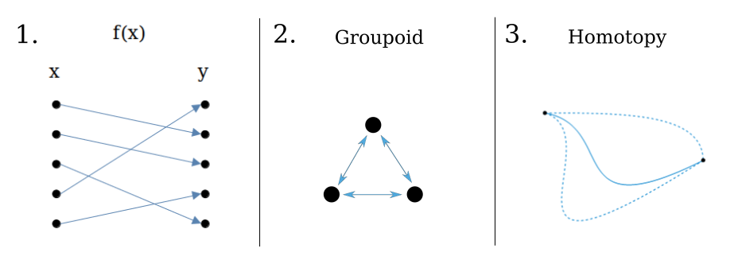

# The future of AI is documentation

While the inverse is obvious (AI can eventually produce adequate documentation), I will argue that the somewhat counter-intuitive flip-side is infinitely more rewarding (documentation can produce AGI, with G for general).  

##

*Note on notation: «technical term» ; "metaphorical" ; "Quotation" ; 'Title' ; equivalent/terms*
  
But before I go any further, I want to make clear that this article is intended to be a meeting point of different cultures, including software developers but not only, so I won't assume any familiarity with the notion of documentation, nor any other niche technical concept (a good thing to do in any case, as the first principle of documentation should say). However, for readers who have an inimical relationship to all things technical, I suggest you start with the next section 'AGI as a paradigm shift', which is about the world we live in. While this section browses over certain aspects of the system as a *solution*, mostly theoretical, the following two on the contrary, 'AGI as a paradigm shift' and 'Naturality of the suggested documentation framework', focus on the *problem* from a political and radical point of view, necessary for the understanding of *how* this solution is indeed a solution, and what's more, a *natural* solution. The last two, 'The documentation process' and 'Return to (generalized) mother', cover additional material for communicating the concept: a factual description and an historical perspective. This is what this text is intended for: communicating/documenting a concept.

Let's starts with the very concrete concept of «documentation» manufactured by programmers:

> "Documentation is any communicable material that is used to describe, explain or instruct regarding some attributes of an object, system or procedure, such as its parts, assembly, installation, maintenance and use." (<https://www.linfo.org/documentation.html>).

In 1984, while the craft of writing computer code was still in its infancy, one of its "founding parent"—Donald Knuth, in an article called 'Literate Programming'—proposed a development paradigm  which prioritized human communication over computer-readable symbols. He meant that the primary focus and "working material" of the programmer was not "a tangle of code" but "a weave of documentation" (his metaphors). It is based on the realization that: "the most important thing about a program is its structural relationships", the pedagogical exposition of which requires a web-like flexible frame, akin to human thinking, as opposed to the rigid tree-like setup of computers. It can be anachronistically called «Documentation Driven Development». Unfortunately, it didn't catch on. The industry was in too much of a rush, as industries always are, to go into that time consuming direction. It still is, and always will be (conscious of the importance of documentation, it favors self-documenting code, but misses the crucial points made by Knuth). Which is really too bad because if documentation respects those three criteria: (1) it's open, as in always publicly available and editable, (2) it's elaborate enough, and (3) it's "holistic" in the sense that every piece of documentation targets interoperability with documentation coming from other sources, then this supposedly platitudinous notion derives into more general views on information sharing and "life in common", can be given a philosophical underpinning in «perspectivalism», and in many ways it can *rectify* the current political paradigm.

Mostly, my work has been the assemblage of this idea with others taken from outside the field of computer science (or «algorithmics» as Knuth suggested), to enable the formation of a kind of "super-documentation" which can be useful for humans and useable by computers. I will be using this abstraction as the motive for the next steps:

> Before becoming a program/algorithm, every project is a concept. The proper start to collective endeavor must be the construction of a consensus around the concept and its representation by mathematics-inspired documentation.

As for AGI or Artificial *General* Intelligence, I'll give what mathematicians call a constructive definition: I'll build a system (computer program) which demonstrates what AGI is by being an instance of AGI. In engineering lingo, I could say I will present a «proof-of-concept». It will also be, of course, a conjecture. To avoid trapping the idea into preconceptions, I will simply refer to this particular system as 'our AGI architecture', where AGI should be understood as a general cognitive/information processing system.  

It can be represented as a «dynamical system», meaning as a chain of subsystems/processes all linked together by the fact that the output of one process is the input of the next. Figure 1 sketches a quick overview. In our case, a key subsystem is a concrete implementation of a mathematical model for neural networks proposed by Yuri Manin and Matilde Marcolli (see their publicly available 2020 paper 'Homotopy-theoretic and categorical models of neural information networks'). Their work is inspired by biomimetics and is only secondarily about *artificial* intelligence. Primarily, it is intended to be a model of actual *natural* brains. I suggest we "feed" those Manin & Marcolli cognitive systems with "tailor-made" human-produced data, itself the output of a specific conversation-based documentation-producing protocol I'll introduce below. This AGI should in turn output a "map of its world" ("digested documentation") and a "universal technical language" (it needs one to exist, and it is perfectly designed to create its own). One can think of the map as a big sophisticated diagram, and the language as its legend. Finally, there are feedforward and feedback relationships between the subsystems and the environment. It is at this level that a paradigm shift (à la Thomas Kuhn) can develop.

__Figure 1 - Our AGI architecture:__  

---

*In a sequence from left to right:*

- *The world we live in is our context, itself the output of the laws of physics, evolution, etc.*
- *The experiences humans have of this world shape their points of view, which go into a "horizontal" conversation-based documentation-producing process. Here horizontality means every human, or "informant", is considered the same by the system. Or we could say "the system only knows one way to interact with information carrying entities". It is achieved by «unityping», a foundational programming concept. Somewhat counter-intuitively, this is actually a way to ensure the system respects the __diversity__ of points of view coming in.*
- *The work done in conversations outputs a documentation of the world/context, which must obey a rigorous mathematical framework for its internal coherence and interoperability. Every piece of information is "put into a box" (type), where the box serves as "credentials" for the enclosed information to participate in computation. For example '3' can be put in the box 'number' and as a number it can take part in multiplications, which would not be allowed for 'b' in the box 'letters'. Of course the type/box system of our AGI architecture would be much more sophisticated than this, in order to create a computable network of (nearly all) concepts.*
- *This network will be compatible with a model for neural networks suggested by Yuri Manin & Matilde Marcolli. It is at this stage that the architecture exploits the power of neural networks, the machinery behind the latest "AI revolution" of ChatGPT and the likes. As a first step, it can develop a satisfactory AGI "core" by training it on the computable network of concepts. Secondly, it can use this AGI to refine the produced documentation and create new knowledge from existing information.*
- *Eventually this chain of subsystems yields a sort of "interactive map of the world" written in the congruous corpus of documentation, along with a "technical language" which is roughly the collection of types/boxes and their "grammatical rules". Both can have a positive influence on the subsystems preceding them, generating a virtuous feedback loop.*

Note: This article is mostly about subsystems *before* the key neural networks subsystem modelled by Manin & Marcolli. This subsystem is too technical practically and too involved theoretically to be discussed meaningfully in our context.

---

In a sense, every text, drawing or story ever produced can be considered documentation, and I believe it should. Yet, the program I suggest we use for documentation is not meant to be the unique filter through which all production of abstract content must pass, but rather a replicable protocol which confers definite legitimacy to its output, useful in specific cases. Those cases should be considered "open projects", similar in nature to open source projects in computer programming, but applicable to a wider range of activities: open farms, open workshops, open hospitals, etc. (Or without a specific purpose at inception, it would be an "open-ended documentation", and mostly about language itself.) All those projects are grounded on the communal documentation of their concepts, and must be «modular» (interoperable), meaning they must be compatible with, composable with and translatable to and from any other documentation—which is feasible thanks a current revolution in mathematics I'll discuss in the next paragraph. At a project specific level, documentation is locally useful, but it is the assemblage and harmonious concert of documentation which gives our architecture a global significance. As such, they would form a kind of open science, in which the systematic encoding of every (interesting/remarkable/unusual) "thing" is an extension of the inquiry into the proper foundations of mathematics, and vice versa. (See '‘What is a Thing?’: Topos Theory in the Foundations of Physics' by Döring & Isham).

There is a slow and silent revolution happening within the confines of mathematics departments, which "elevates" the rigid framework of «set theory» to the more abstract and flexible «category theory», capable of dealing with ambiguity, redundancy and translations between structures, as explained in figure 2 below. For its advocates, it is an opportunity to encode all scientific concepts into a common language endowed with special properties which reveal and make use of "structural relationships". It has found uses in the conceptualization of computer programs, physics, biology and more, through applied category theory. The mathematics used by current AI implementations are still rooted in the old foundations (it is pretty much the same as the math behind Einstein's general relativity). The model of Manin and Marcolli, on the other hand, uses category theory to its fullest. It takes homotopy types as input and feeds them to groupoid-like neural networks. Our architecture mirrors their model: it uses groupoidal "social" structures to produce concepts encoded in homotopy types, which can then be fed into neural networks.

__Figure 2 - Abstract mathematics for our AGI architecture:__  

--- 

*19th and 20th century set theory is an incredibly powerful mathematical framework upon which all of mathematics was expected to rest, but more recent development have exposed profound inadequacies. Especially the developments introduced by Alexander Grothendieck and used by Manin & Marcolli for their model, and incidentally our architecture.*

1. *This diagram represents a "classic" function f(x) = y, where f "transforms" values of x into values of y, and is representative of set theory. The dots on the left represent the set of all possible values for x, and the arrows point to their corresponding values in the set y according to the function f, the dots on the right. Set theory is mostly about how one forms and thinks about those collections of dots/mathematical objects. While this framework is powerful and perfectly legitimate, I will contend it can't handle the kind of complexity we are targeting.*
1. *This simple diagram represents a «groupoid», which is itself an emanation of a space. It is defined by the provision that all pairs of dots (here: points in space) must be linked by a two-way arrow (here: paths back and forth between the points). I won't go into technical details and give a general statement to capture the mathematical essence of it: "groupoids are the foundational structure of occupying abstract spaces". In Manin & Marcolli's model they are more or less the neural networks, viewed as "spaces of information". In our architecture they are also used for modelling the documentation-producing conversations, also understood as "spaces of information", taking place between humans, the information providers of the system.*
1. *This more elaborate diagram represents «homotopies» between paths in space (homo = same, topos = place). Granted we have two points in space and two different paths between them, homotopies encode the ways in which one path can be transformed/deformed into the other (possibly none). The essence of it would be: "homotopies are the fundamental structure of describing mathematical objects". Manin & Marcolli follow a beautiful current trend in mathematics and computer science which intends to encode all mathematical objects and their relations into homotopies: «homotopy type theory» (where "type" is the same as our "types as boxes" in the legend of figure 1). In their model, homotopy types are the "food" of the neural networks, what they handle. In our architecture, we ask documentation to be encoded into this language, to be this kind of "food", digestible by "groupoidal" neural networks.*

*A key difference between set theory, where the underlying objects are all considered "in isolation" from one another, and the more elaborate structures of groupoids and homotopies is the ability for the latter to take into account "ambiguities", redundancies, possible translations between similar enough concepts or any other "extra structure" the objects in question may have. Without those, the accumulation of documentation would turn into an impossible mess, whose usefulness would be restricted to very "local" situations and still require the supervision of specialized individuals accustomed to this domain of knowledge—as is currently the case in science and engineering. While this familiarization effort with a local topic is an unavoidable "cost", it can be greatly reduced by the coherent global map of the context/world and the universal technical language which are produced by the AGI architecture, along with the AGI itself.*

---

In practice, our AGI architecture insulates a "social" documentation-generating process capable of (i) minimizing assumptions, unnecessary conceptual constraints and false positives "on the input side", and (o) maximizing modularity, composability, reusability, etc. "on the output side". (Later I will propose a 'cell model' inspired by biology.) This is in contrast with the current state of documentation in engineering, for which I list the main issues, tagged with which "side" is affected :

- It is private (o); it is designed and used by private limited companies with their restricted scopes and interests in mind (i).
- The mainstream "philosophical framework" comes from object-oriented programming, which has its advantages but is now considered outdated, especially in this hyper-connected world (o).
- There is no mathematical framework into which information can be encoded, just "naive" illustrations with conventions for recurring concepts (i/o).
- The represented information hardly expands understanding (o); it is rather a form of record keeping for those already "in the know" (i/o).
- Representation of context is usually rudimentary and the isolation of each project makes it impossible to reconstruct a "shared context" (i/o).
- It is largely independent from and incompatible with the academic practice of science—which has its own set of documentation problems, only some of them overlapping with engineering (i/o).

This is also in contrast with the kind of documentation which is "fed" into current implementations of AI, what they are trained on: large datasets, or more generally data science. While this food is cheap and indeed "digestible" by neural networks, and yields the well known results of ChatGPT or DALL-E, it also comes with a number of technical weaknesses and structural problems, most notably political and cultural biases. As with engineering documentation, those are reflecting the issues of the apparatus which generate them: the "wild West" of the internet and its decidedly capitalistic essence (the "com" in .com stands for commercial, not communication), which can only be naively thought of as an emanation of the real world (data science is mainly a branch of marketing, not mathematics). I won't go into the technical details here, and refer the interested reader to Marcolli's critics of LLMs, or large language models, which she presents in her series of lectures 'Mathematical Models of Generative Linguistics' (lectures 17 and 18, freely available online). Her critic is specifically geared towards the *theory* of Large Language Models, which she claims can't apprehend language on a computational level because it was *already* unable to apprehend language on a purely linguistic level.

I will detail the proposed documentation framework below, which includes theoretical foundations, a methodology encoded in a computer program and an expected evolution. Briefly, and in contrast with the list above, its strong point are:

- It is open, and in many ways can be the foundation for an "open source economy".
- Its organization is based on concepts coming from concurrent programming (how to instruct multiple processes to work in harmony on a single task), especially the "philosophically egalitarian" «actor model». (A slightly different flavor of concurrency is also an important ingredient in Manin & Marcolli's model.)
- It has mathematical foundations which follows and extends Manin & Marcolli's model, as explained above.
- It is a proper implementation of Donald Knuth's idea mentioned above, where one starts with and builds upon documentation of core concepts.
- It must include context and can produce a "panoramic view" via interoperability.
- It can evolve into (1) an AGI system, and (2) a satisfactory form of open science.

Before I go back to the particularities of this implementation, I will explore the general context into which it is embedded, how it can help understanding it, and how it can "naturally" solve some of its foundational problems.

## AGI as a paradigm shift

In this article I will indeed argue that the emergence of artificial intelligence in human society is an opportunity for timely positive change. Eventually in terms of what it gives, but more immediately—and unexpectedly, in terms of what it requires from us. To do this I will explore and use concepts coming from 4 different cultures, especially where they overlap: practical geeks, theoretical geeks, practical radicals and theoretical radicals. I will give examples of what I mean with each category (which I call by its stereotypical name on purpose, for visibility) but unfortunately they will only be understandable to those with access to the culture. Respectively: Clean Coders, Homotopy Type Theorists, Yellow Vests, Noam Chomsky. If you don't belong to any of them, don't worry, I wrote this article for you. It is by no means a light read, but it is accessible to anyone who will take the time to dig into it. My main goal is to expose the concepts I take from each culture to the "outside world", in order to find consensus on the Artificial General Intelligence system sketched above, which takes human communication as input, includes both a technical and a political side, mirrors foundational structures in mathematics, and which is, contrary to the current paradigm, both efficient and sustainable.

The shift of paradigm concerns the core of our "civilization". Specifically: specialization, selection, hierarchy, representation. By civilization I mean a social system based on those 4 mechanisms, which I sketch in figure 2 below. In each case the system which implements them loses information and gets corrupted by the social determinism necessarily emerging through competition between individuals (the system "cuts ties" and "misuses ties"). Together they form the main cogs of this fantastic civilization machine running with incredible strength and speed into a double brick wall: (a) the physical limitations of the environment, and (b) its own limitations as a badly designed system. It is set on a collision course with: (A) the planet, because the machine's output is detrimental to the environment it is embedded into, which in turn sends its "negative" output back into the machine (a vicious circle, for details see the theory of dynamical systems, cybernetics or Spinoza); (B) itself, because it confuses "optimal" with "maximal", and indiscriminately exploits all production opportunities regardless of purpose and physical resources. It uses force whenever applicable, all the while wasting/suppressing copious amounts of cognitive resources (see the need for manufacturing consent or the wave of professional burn-outs, addictions and many other telling psychological conditions—more generally the cold absurdity of the global economy in the context of imminent global disaster; there is also a hidden part: "mutilations", which I will invoke later).

__Figure 3 - the 4 mechanisms of civilization:__  

---

*Resources are humans, considered as a cognitive resource. Assignments are when a human is given a type. Types can be a role in the case of specialization: a set of tasks to do in exchange for means of survival/luxury items (which is incredibly impoverished in the case of "scientific management"), a grading in the case of selection: a token giving access to tasks (where most of the wasting of cognitive resources happen and "old assumptions reproduce"), a position in the case of hierarchies: tasks are ordered and with them social status, and in the case of representation: privileges to amend the system.*

*In a sequence from left to right:*

- *Specialization is supposed to be the cornerstone of civilization, the inescapable route to adequate knowledge. It seems evident that an expert will know more than a non-expert, and therefore a system which encourages expertise will know more than a system which does not. I contend this is naive in two ways: (a) humans will specialize whether or not the system encourages them to do so or not, and it is more judicious to let every individual freely decide on their domain and level of expertise rather than force it upon them, especially when the "forcing" is based on "where do investments go"; (b) the acknowledgment of experts comes with "hidden costs", in the form of selection, hierarchy and representation, all with detrimental effects on the "cognitive power" of the system (discernible through the framework of «concurrency theory»—the orchestration of multiple processes on a single task: harmonious orchestration is disrupted if one disregards key design principles; in our case that would come to light as "social friction"). Moreover, experts in a capitalistic economy have an incentive __not__ to share information (you will notice capitalism is copyright-based while open source projects are copyleft-based) and to "crystalize" their thinking and point of view (a fixed idea is easier to sell than an flexible one).*
- *Selection, hierarchies and representation frame the specialization of individuals by enforcing further typing on them. Selection appeared more recently to replace simple heredity and gender based roles (because of the need to fill in key roles in the new industrial economy, notably engineers). Hierarchies serve as control mechanisms on specialized work. Representation used to be amalgamated with hierarchies, with the top positions being in charge of amending the social system/economy. Now the two mechanisms are separated between private and public sectors, the economy and the nation respectively. (The diagram represent a democracy/oligarchy; a dictatorship would have only one option on the right hand side.)*

*These diagrams are unmistakably set theoretic in nature. Again, our architecture uses diagrams where humans are not assigned a type, or rather are all assigned the same one ("conversationalist"), and only documentation is typed (replacing specialized individuals as "information containers" in the system).*

---

It is quite difficult to argue against the efficiency of civilization. It is almost universally accepted, the common conception is that it saved us from savagery and our base animal instincts—without it we would still be living outdoors and hunting game. It was and still is considered to be the only way "out": it's civilization or chaos (one of the main messages of the epic of Gilgamesh, a foundational myth of civilization). I believe this is ingrained in the collective mind because civilization comes equipped with its own propaganda machine (a consequence of the 4 mechanisms, which are all acts of violence requiring justifications—in many ways civilization started with those justifications, in the temples of Sumer, about 7,500 years ago). It captures any discourse which portrays it in a positive light and turns it into assumptions which "take root" and "mature" in its memory (both elitist and popular culture). It is again allowed and organized by the 4 mechanisms: every time someone climbs up a hierarchy, a legitimation of the hierarchy climbs with them, or every time an advertisement is broadcasted, it implicitly broadcasts a legitimation of the whole system with it. Due to mental shortcuts and biases in epistemology, to criticize civilization is to object science, social contracts, peace among nations and progress in general. (And we humans absolutely need this concept of progress for our psychological survival in such a harsh social system.) While civilization takes all the credit for itself, it also delegates all problems concerning "life in common" to "human nature" (strikingly similar to the logical fallacies infecting an addicted brain, according to Allen Carr—in many ways we are "hooked on" those 4 mechanisms). If ever civilization fails to provide its advertised accomplishments, its advocates will maintain it's not because of its own shortcomings but because it has been mishandled by humans and their *natural* defects. For example, police brutality will not be analyzed on a systemic scale, and the "few bad apples" rhetoric is given instead. The fact that our global most pressing social issues can be directly traced back to the 4 mechanisms of civilization doesn't seem to tarnish its reputation (in order of historical emergence: patriarchy and gender roles, racism and all forms of discrimination, large-scale armed conflicts, class struggle & poverty... the true and inescapable nature of civilization). Again, those issues are often assumed to be intrinsic to human nature (despite the fact that archeology and genetics decidedly proved the contrary, see ⟨hal-02112784⟩). As for obvious structural defects not imputable to human want, such as planned obsolescence, their existence is legitimized by the necessities of capitalism and their effects are largely minimized/ignored. The machine carries on.

*In the interests of space I will not develop a critic of engineering under the influence of the 4 mechanisms and in the service of a palace economy (by palace economy I mean ancient Sumer, Egypt, Rome, etc., as well as the current global economy). I will simply state it: current engineering is "degenerate". It has the same kind of "efficiency" as a cancer cell: it grows, spreads and conquers, but it does so on a way that kills its own environment. (Almost all current research is harnessed for new technologies, and all new technologies are harnessed for new forms of colonialism: of the environment, human minds or abstract concepts.)*

It is even more difficult to argue for an alternative to civilization, since none have been able to withstand its competition, military or otherwise. Almost all surviving human groups have now been colonized one way or another and carry the "4 mechanisms gene/virus". The paths to complexity of alternative social organizations, even when properly studied, have been ignored or misinterpreted, especially in the case of African Egalitarianism (see James Woodburn or the Harvard Kalahari Research Group for details). Even in social theories of evolution, civilization is isolated: there is only one way to human progress (largely taken to be technological progress, behind which looms military and propagandist expansion) and it is civilization (largely taken to be the Western world, the top military and propaganda machine). This view has been labeled the "unilineal evolution theory" in the 19th century. Wikipedia claims that "[t]his theory is now generally considered obsolete in academic circles", and while this is probably true, there are no tangible signs of a globally coherent replacement for civilization and its mechanisms in the scientific literature (a few exceptions have been incredibly inspiring for my work). Although there are indeed plenty of initiatives meaning to counter-act the defects of the 4 mechanisms, such as open science or participative democracy, those are considered to be "the next step in civilization" rather than a deep questioning and remodelling of it. The depth of this questioning is approximately measurable in the size, history and "fundamentalness" of the assumptions being questioned. In this light, my critics and recommendations stretch to the bottom of the "political ocean", and will probably appear as "crazy talk" by anyone who doesn't belong to the radical type. But I must include this "radical" political side of the story for the "geeky" technical part to make sense.

Appropriately, the main sources of inspiration for our AGI architecture are all anchored on both sides, "geeky" and "radical":  
(All information retrievable from the respective Wikipedia pages)

- Alexander Grothendieck is the principal architect of the mathematical structures used by Manin & Marcolli for their model of cognitive systems. He also quit his comfortable position in the French research system on the grounds that it was funded by the military, to start an activism-oriented journal on ecology called "Survivre et vivre". Another important mathematical figure here is Bill Lawvere, who was also a Marxist.

- Noam Chomsky is a linguist and co-author of Marcolli, together they explore the links between mathematical structures and "universal grammar", the common core of all human languages. He also identifies as an anarcho-syndicalist or a libertarian socialist.

- Gilles Deleuze is a philosopher who produced a «perspectivalist» framework, in which truth is not absolute as in most philosophical traditions but dependent on a specific point of view; without being totally dependent on it, as in relativism. This perspectivalism can serve as a motivation, or *raison d'être*, for our AGI architecture. Like Grothendieck, Lawvere and Chomsky, he was very close to the 1960s' counter-culture and critical of capitalism and all control mechanisms. A key idea for us would be: "Modern society still suppresses [being] and alienates people from what they can do" ("being" here is an approximation for the more elaborate but semantically confusing concept of "difference").

Rather than "alienation" I would like to use the stronger term of "mutilation" to express the acceptance of one's status and through it the lessening of one's potential. Something Grothendieck also mentions in his 1972 conference 'Allons-nous continuer la recherche scientifique?' at CERN ('Will we continue scientific research?'). This is a direct consequence of the arrows in the diagrams of figure 3, where a human cognitive resource is assigned a type. Our AGI architecture proposes an alternative in which those arrows are absent and replaced with more elaborate and "horizontal" mathematical structures. This will safeguard individual freedom and through it "communities of attachment". Attachment theory is a psychological and evolutionary framework concerning the relationships between humans, particularly the importance of early bonds between infants and their primary caregivers. It can be abstracted away in a simple and "continuous" algorithm of networks:

1. The network of existing elements allows new elements to develop adequately (element ← nurture).
2. Adequately developed elements form a network capable of helping a new generation of elements to develop (element → nurture).

Eventually, I will argue that the preservation of the autonomy and "naturalness" of this algorithm is ultimately what is at stake for the sustainability of humanity's social system and with it, its context/environment (crucially, autonomy and naturalness here imply not imposing any preconceptions on what "adequately" means). It can be achieved because the mathematical structures on which our AGI architecture is grounded can be interpreted in this attachment framework as conversation (groupoid) and empathy (homotopy), two major factors/mechanisms in the formation of "communities of attachment". In many ways, high complexity seems to require this kind of sophistication in the design of network architectures, if such networks are to exploit this complexity for computation, cognition, understanding, etc.

## (Mathematical) naturality of the suggested documentation framework

In its "geeky" incarnation, the suggested AGI system is a form of open science with computability capabilities, where open means science without selection of individuals/cognitive resources (which is not the same as science without truth criteria, similar to how perspectivalism is not relativism), and computability refers to its artificial intelligence side, its ability to derive extra knowledge from existing knowledge. In its "radical" incarnation it is a resistance network enabling the creation of autonomous communities, occupying new abstract spaces and based on different principles than the 4 mechanisms of civilization (not a reform of the existing system, not a revolution wanting to take it down, but an independent process which *creates its own space*, as I will explain more in details below). These two incarnations are co-dependent: communities need complexity/science for sustainable growth, while complexity itself needs communities to create adequate spaces in which it can emerge.

I won't compare civilization and our documentation-powered AGI system point by point, but focus on those three aspects: (1) people are ready for it, (2) it's accessible, and (3) as a solution it is "natural" in a mathematical sense.

1. People are ready for the paradigm shift and demonstrated their willingness to look for collective structures outside the 4 mechanisms during the wave of popular protests of the period 2018-2019 (see 'The age of mass protests' by Brannen, Haig & Schmidt for a factual recap). In 40 different countries, movements emerged with unmistakable common traits, which all have to do with the *negation* of the 4 mechanisms. They didn't have:

    - representation: the movements were decidedly "bottom up" or "grassroots", and rarely had public figures as leaders.
    - hierarchy: the movements had horizontal/diffuse internal structure.
    - selection: the aim of the movement, or rather its *raison d'être*, was not defined in advance.

    What conditioned adhesion was not a specific set of held beliefs but the organizational philosophy of the movement. While their influence on the collective mindset was certain (but largely wiped off by the Covid crisis which directly followed), their actions didn't amount to anything concrete and durable: they never *specialized* to anything which could become an acceptable member of the body of institutions, such as a union or political party. They would have had to renounce their organizational and philosophical principles to do so, and did not. As such they exhibited a new form of practical "societal maturity"—they were truly flourishing practical radicals, but without enough theoretical "political maturity" to turn their spontaneous movements into the structures adapted to their philosophy. (The only existing political structure compatible with it are citizen assemblies, which I will use as the "base module" for the documentation procedure explained below. Those have been well tested since their first implementations in the 1990s and have always generated satisfactory results.) On a psychological level, those movements were also experienced as a break away from alienation/mutilations and a return to non-institutionalized communities .

    *Note: At this point I would like to indicate that I first thought about this architecture as an engineer of human communication systems, inspired by the beauty of such movements. I then proceeded to find it a mathematical model, which I found in Grothendieck & Lawvere mathematics, and only recently did I find out about the same model in Manin & Marcolli's cognitive systems (to some extent, this overlap and compatibility validates my research up to this point). In order to widen my understanding of the architecture and its context, I used the theoretical bridges of category theory and the practical principles of the implementation to make forays into other domains of inquiry (philosophy, physics, biology, as well as humanities). The next step was to find the most compact abstractions, algorithms, diagrams, etc. and eventually present the most interesting and convincing aspects in a relatively short article with manageable complexity.*

1. The implementation of the architecture is accessible because it will *indirectly* replace the 4 mechanisms with new structures coming *directly* from the foundations of mathematics.

    A crucial «design principle» of our AGI architecture, which is mandated by the mathematical structure, is clear separation between reality (≅ "where we do life") and the abstract (≅ "where we do language"). As explained in figure 4 below, every project following this architecture should be "insulated" and (1) have as little associations with reality as possible, and (2) manage its own language. It is this principle which induces the creation of a new space. It confers lots of advantages to the abstract module (what emerges in the new space), but also to reality itself, which is protected from a possibly detrimental influence from the abstract realm. For instance:

    - AI systems are safe (no mechanical leverage of AI in reality, no AI takeover possible, no global schizophrenia/loss of sense of reality, etc.)
    - Without a "broadcasting apparatus" in reality, the abstract module can't generate interferences such as advertising/marketing/lobbying/... and other opinion & moral compass influences.
    - Freedom of work can be granted with enough open projects working on sufficiently elaborate open documentation.  

   This «separation of concerns» also makes the implementation of the architecture easy. (For a "translation" of this story in "practical geek" lingo, see 'Typed dataspace actors' by Caldwell, Garnock-Jones and Felleisen, where actors are our "egalitarian" cognitive resources and the typed dataspace is our new abstract space).

    - Because the replacement is indirect, there is no need to modify existing structures. The new paradigm will emerge in an abstract space made of thought, language, computer code, mathematical structures and their complex documentation. This space will be new: it will start empty and only allow information to come in according to a unique protocol for all "informants" (humans in conversations) and following some «type theory» for coherence. See figure 4 below: the "cell model" of new abstract spaces. Both the initial emptiness and the uniqueness of the protocol are filters/safeguards against the introduction of assumptions/false positives into the new space. (Interestingly, they are also in direct conflict, meaning that they are mutually exclusive, with the 4 mechanisms of civilization, which require assumptions as "dependencies": the assignment of the initial body of experts and managers of future assignments.) As developed above, this homotopy-based abstract space is expected to evolve into a complex and multidimensional network of concepts which could be viewed as a map of the informants' context, our world, or as a "universal technical language" (a language purposefully designed for science and engineering, with manageable complexity thanks to homotopies and extremely useful for our "life in common" problems). These new spaces and their documentation are the emanation of the "horizontality" of the protocol and can act as "abstract managers" for open projects, the instances of open science and an open source economy. {legitimacy.} Once they are sufficiently mature, they will offer an efficient and sustainable alternative to the current global economy.

    - Because the base concepts are mathematical structures and they only require some computer code and internet access to run, the costs of implementation are very cheap. The system is moreover totally autonomous, without control mechanisms, without managers. As we've seen, people are ready for such organizations, so we can expect spontaneous interest and participation. The concept only waits for its recognition and legitimation to start and grow. (Its parts are all legitimate concepts in the eyes of the research community already, but the combination of them is not yet discussed in the scientific literature. (I found a glimpse of it in 'Social Machines for All' by Papapanagiotou & al.)

    See figure 5 below for a quick overview of how our AGI architecture can be "plugged into" open source projects, creating a network—an open source economy, which can in turn fuel autonomous communities without the need to resort to the 4 mechanisms.

    __Figure 4 - The "cell model" of new abstract space__

    ---
    

    *The cell we imagine here is a metaphor for an open project whose purpose is to create a technical language for mathematics, science, engineering and the arts, with two main criteria in mind: (1) low entry costs for humans (pedagogical), which importantly includes reuse of concepts across domains—a "versatile base toolkit of core concepts", and (2) the ability to deal with high complexity. (Both challenges would be met with heavy use of homotopy type theory.)*  
    *This new language would be considered the "new abstract space" in this case.*  
    *I choose this example because it is where a network of such open projects should start, by managing its own language. As a "language creating unit", it can be thought of as a sort of stem cell, something that could later be duplicated and used as a basis for more specific purposes.*  

    *Following the numbering on the diagram:*

    1. _Reality, or the context/environment. For the metaphoric cell that would be a soup of molecules, and parameters such as pressure, temperature, etc. For the open project that would be our shared human context, whose "atomic constituents" are information/knowledge/concepts._
    1. _The cell wall which delineates what is the "new abstract space" on the interior and what is its environment/context on the outside, is a design principle known as «separation of concerns» which states that the two sectors should have as little "connections" as possible. This is vacuously true on the side of the new space before it comes to existence. The difficulty lies in the insulation of this space from reality. Fortunately, this is already what language, logic or mathematics do "naturally", so they can be included. Inversely, people's lives, buildings, money, etc. must be excluded._
    1. _The cell wall has a "protocol" which regulates how information comes in. This is carried out by a distributed computer program. This protocol is the subject of the next section, but in brief, it is a network of conversations, where conversations act as "filters" collecting and refining information coming from outside the cell wall. (Conversations are modelled on the concept of citizen assemblies in participative democracy). As for the "actual thing" running the program which generates the space, it operates by "reversing dependencies": it states what it needs (very little) and it simply expects those needs to be met, without any form of interference or compensation. (Technically, it should be like a torrent network.)_
    1. _This computer program acts as a genome, it has a starting kit of document types and gives a procedure to produce documented concepts. Those are the "proteins", or working units of the open project, what determine its "state" and "function". (In this metaphor, humans act as catalysts or chaperones.)_
    1. _The produced documentation is the cell. If it is indeed compatible with others, as required by the mathematical structure but also enabled by the same mathematical structure, cells can form organisms. In our case, an open science and an open source economy._

    ---

    __Figure 5 - An overview of open source economy__

    ---
    

    *legend*

    ---

1. The notion of "naturality" in mathematics comes in two flavours. There is a technical and formally defined concept which applies to "transformations between mathematical structures" in the most abstract branch of mathematics—the "home" for our AGI architecture: category theory (which actually started in the 1940s with this very notion, see Eilenberg & Mac Lane). Naturality is here akin to the "types as boxes" metaphor above: objects which can be put in the box labelled "natural transformations" have special mathematical properties and can participate in interesting operations. I will not develop them here. I will instead rely upon the other flavour: naturality as an informal, qualitative judgement on solutions to problems. For a quick example, see Yuri Manin's interview for the Simons Foundation, when he talks about Alexander Grothendieck. Also, I will generalize the mathematical context to problems in general, including engineering, philosophy, etc. A solution can be characterized as natural if:

    - It is universal, in the sense that it can be applied in many, possibly quite different situations.
    - It is simple, but not necessarily obvious. It might take effort to see how a simple operation will produce the desired effects. While the solution is indeed simple to comprehend, it can still require effort for the understanding of the problem and its context, for *how* it is a solution for it. This happened to a beautiful and remarkably universal mathematical structure called a topos, introduced by Alexander Grothendieck—by his own admission the most important of his creations, whose potential is taking a very long time to develop in the hands of others. Because despite the accessibility of the formal definition, understanding its usefulness requires seeing it from a specific perspective, which is not "obvious" for most mathematician. (It breaks with established conventions, uses an unfamiliar methodology, and in many ways solves problems mathematicians don't know they have.)
    - It manages complexity. If we understand a solution to be a certain perspective on a problem and the course of action this viewpoint entails (following C. S. Peirce's pragmaticist maxim), the solution can "lose" complexity by truncating the problem and only partially or inadequately resolving the situation. But it can also tame complexity if the perspective preserves what is important and useful in a "compressed" version of the situation (this is encoded in category theory by the notion of «limit»). At this point a natural solution can emerge.
    - It is a "plateau of understanding", below which operational details can be safely forgotten, and upon which one can build further understanding, cognition, new tools, etc.

    I believe our AGI architecture meets those criteria.

    - The scope is broad: It is a solution to the problems of "life in common" or "parallel processing" for information carrying entities endowed with language.
    - It uses only a handful of core concepts and makes repeated use of them, to build a structure that can scale up gracefully (notably groupoids and homotopies). If it is not obviously a solution as of yet, it is due to deeply rooted assumptions about how a social system gains cognitive power (namely, it supposedly requires the 4 mechanisms of civilization).
    - At the most general level ("up"), if our AGI architecture is indeed a valid solution, this suggests a seducing perspective on Nature which I haven't exposed here: a generalized theory of evolution "by coverings", where every step in the evolutionary process must "map/triangulate its world" and in doing so allows new and unexpected systems to emerge. See figure 6 below. Operationally ("down"), with the mathematical notion of homotopy (encoding how two "transformations" are equivalent), the documentation process can efficiently and indefinitely compress its content and organize it in appropriate levels of details.
    - Importantly, while it is in itself a natural solution, it is also a methodology to find more. It is the "collective" counterpart of the "individual" scientific method, whose scope/domain of application is restricted to individual examiners and their direct relationship to Nature. The 4 mechanisms of civilization use the scientific method but the assignment of roles also restricts it to its individual incarnation, while our AGI architecture properly enables a collective examination, mobilizing a *shared* relationship to Nature.

Figure 6 - An overview of a generalized theory of evolution by coverings

---

> *legend*

---

## The documentation process

I will first give a very brief and necessarily truncated factual description of the system, then complement it with subsections in a Frequently Asked Questions format.

### -      -

#### What is a conversation?

staffing, prerogatives

### --     -

#### How does the system "refine" information?

1. The system doesn't "collect" information from experts directly but make use of a special entity which we can call the "random person". (expert -pedagogy-> random ; many -participation-> random ; many <-tech lang mastery-> expert)

How does interoperbality work? How can we put all content into one big network of concepts?
Thing -model-> mathematical object ; for all mathematical object we can ask what is its homotopy types, every pair of homotopy types can be compared.

Who writes the programs?
volunteers

Who runs the programs?
benevolent entities

## Return to (generalized) mother

{I didn't say: derives into notions of perspectivalis... ...and has origins in "egalitarian mythology", because I would have instantly lost all credibility, but this passage, representative of a corpus of testimonies and their analysis is quite telling -> quote (replace nugget with "pivotal concept"). It is a dense network of concepts, exactly what we need if we are to recover our "evolutionary path".}

Define trust, and how our AGI architecture is the most trustable system possible, because it is also the most "horizontal" (no assumptions).

---

---

---

Figures:

- groupoids and homotopies
- cell model of new abstract spaces
- open source economy

« » —

# Trash

 and following some «type theory» for coherence (giving the ability to compare things, using homotopy type theory in our case, as in Manin & Marcolli's model)

{The 'Aside on mathematics' below should clarify the relationships between conversations and documentation on the one hand, and neural networks on the other. {Very practical/organizational stuff -> abstract math -> practical map & language}}

by virtue of consistent encoding into foundational mathematical structures

, they amount to a form of open science. Or, from the reverse but equivalent point of view, we could call it an open science in which the quest for the proper foundations of mathematics extends to a systematic encoding of every "thing". To make sense of this, I must clarify what mathematics I'm talking about—coming up next and accessible to non-mathematicians, before I return to the properties of our AGI architecture.

{ in 1972 d Knuth wanted to make it the primary driver of the craft of writing computer code. It didn't catch on. The industry was in too much of a rush, as industries always are, to go into that time consuming direction. It still is. It's really too bad because if documentation respects those two criteria: (1) it's elaborate enough, and (2) "holistic" in the sense that every piece of documentation targets interoperability with documentation coming from other sources, then this notion derives into...}

It also derives into general notions of information sharing and "life in common", it has a philosophical underpinning («perspectivalism») and in many ways it can *rectify* the current political paradigm.

All those projects must share a common theoretical backbone for their documentation, found in abstract mathematics, specifically in appliced category theory. Together they would form a network of congruent documentations, a kind of open science, upon which we can build AGI systems. {Open science in which the quest for the proper foundations of mathematics (hott) extends to a systematic encoding of every "thing" (topos). The common thread, that which allows the seamless passing of information between the different subsystems of figure 1, is the mathematical structures.}

    Documentation is a natural solution to the problems posed by evolution to humans. What's the problem (information sharing: how?), what's the solution (information sharing: convs & empathy) (see figure 3) <= play the grothendieck card à fond. He is the architect of the common structure between experience, documentation,  (it is more rewarding to think in terms of arrows rather than structures), his methodology is the "invariant" between his theoratical geekism and practical radicalism,
    
        {not the mere addition of fancy Greek words into English---where the old and respectable civilization meets the new and currently dominating civilization)}

    What is naturailty in math? A specific class or type or kind of solutions. The name refers to the fact that those solutions have a qualitative aspect, requiring simple machinery and exposing beautiful structures. Defined negatively: it does not use "mind-bogging technicalities" (for theoretical geeks), "cheats" or "hacks" (for practical geeks), "cumbersome laws" (for practical radicals) or "unethical means" (for theoretical radicals).
    What is this "solution"? I've insisted on the term "architecture", by which I mean "software architecture". As a concept it has a larger scope, but as a solution it is just a program (a congruence class of).
    Sadly really hard to "expose to the outside world", the next point might seem nebulous to most. But this prgram is a "natural" solution in a mathematical sense.
    It can be stated in a series of statements. First, let me give compact abstractions for the concepts of typing and unityping:
    
    - typing: has to do with the more fundamental notion of information, for which types serve as containers endowed with extra properties, e.g. they can be "sorted", "multiplicated", "composed", "be assigned a path to another container in a topology", etc.
    - unityping: is the same as above with the extra restriction that all the containers are of a unique type.
    
    Now, the series of statements, a conjecture of sort (the symbol | is used to mean OR):

    - typing is important | useful
    - unityping has advantages over typing in certain situations
    - the abstract | language & communication is able to mobilize typing
        - for computability, categorification, homotopies...
        - via documentation
    - reality | "life in common" poses problems when implementing typing on cognitive resources, while unityping efficiently and sustainably (recursively~continuous algorithm of networks) solves those problems.

    This is our AGI architecture, which is implicit in M&M model in the way they use concurrency and a theory of resources.

    Another presentation, in a sentence,could be: "The «terminal object» is the best organizational principle in the most generic context." Where "the «terminal object»" is a stand-in for what Grothendieck called "his vision", his whole point of view on mathematics, and where "the most generic context" is a generalized version of evolution (encompassing logic, math, physics, biology, psychology; whose ground concept is not natural selection but the mathematical notion of covering | simplicial sets | fundamental groupoids).

    An alternative presentation uses the interpretation of groupoids and homotopies in the theory of attachment, as conversations and empathy respectively. It is sketched in figure 5.

     Philosophically, if reality was just a car, we would want the abstract space to be a plan, or documentation, of this car. And the first rule of being a plan is *not* to be thing itself.

Of course there are plenty of adequate criticism of the 4 mechaninsms in theoretical radicalism (cybernetics, holism, post-modernism...) but all of them tend to preserve the status of the analyst and specialization in general (both are necessary for the legitimacy of the critic itself). I do not claim to have a privileged status in the research community. The work I've done was quite accessible and only required wiring together a number of concepts coming from . Difficulty lies in the separatedness of those concepts in academia, which requires going up and down in its convoluted tower of Babel. It is made easy once you've understood the foundational design principles behind all the concepts involved, which is best described by the metaphor of "horizontality".
On the contrary, and in line with this research, I claim a special status for the ideas presented in this article: they compose a "natural" solution to the current problems facing humanity, at an "evolutionary" scale. Evolutionary because what . And natural in a mathematical sense.

-> Critics abond in theoretical radicalism (cybernetics, holism, post-modernism..., but they always keep the status of the critics (necessary for the legitimacy of the critic itself). Even though "unlegitimate from the point of university", the most acute critics come from "primitives"/cultures who realy know an laternative and "disanfranchised"/cultures who know misery. I do not claim any status and actually positively demand to be unstatufied (which I am by default, I have not been selected, acheived a hierarchical position, been elected as a representent, I have no role). But the concept has a status: it is an engineering solution to a general problem which is natural in a mathematical sense. -> Paragraph on sources

{
{...and it gives credit to what would be pure conjecture---but nevertheless surfaces from Marcolli's research}. At the same time, it's best to explain the gist of the political "algorithm" in technical terms (it is clearer, makes its purpose ~evident and avoids ~drama).

Before: It's always assumed that only expertise (typifaction of humans, specialization) can enhance the general amount of knowledge of a social system. But it depends how you count. What does the *network* know? Is fluidity/sharing a factor? Brains tend to be "smart" when they're interconnected. {Is it just specific_item.exist_once accumulator or specific_item.times_number_of_holders on a network.}

I will now give a compact version of the alternative our AGI architecture suggest, in (accessible) geeky terms. Aside on "in nature" in math lingo -> the structures that appear when solving interesting problems, {true?: again and again + useful => "natural"}. A foundational notion on the technical side is that of a *type* (or a type system, type theory, etc.) used by both mathematician and computer scientists to work as "boxes for stuff". Basically, {box = type (allowed values) = numbers/lists/..., stuff = "term" = 3/["e", "b", "o"]/... ; the system *defines* boxes and operations/procedures on boxes, then *applies* to stuff; bugs = wrong box/type => impossible procedure for a term/thing}. There are two kinds of type systems: (a) untyped, where every bit of stuff goes into the same box (might sound unsophisticated but is extremely important "in nature"; should be and sometimes is called unityped) In a nutshell, our AGI architecture requires that "informants" (humans) are all considered to be of the same type, and thus the operations the system/computer program applies/"demands of" them are always the same: the system only knows one way to interact with the informants (as "terms", they can be as diverse as they want, only the box is unique, and they should be as diverse as possible for the system to do interesting things). This ensures "no assumptions" and freedom of thought (really freedom of point of view on the world). ~= peer review. No ethical motivations whatsoever, but it "turns out" that the most efficient system agrees with our most general notions of decency and fairness (in a nutshell, what humans call a "honest conversation"). Only information is typed (=> documentation), but because the system "wastes no energy" in typing humans, it can focus on typing information. This lowers the costs of learning new things for humans (vs. "tribal knowledge"), of comparing things (homotopies) and putting our knowledge in proper/scientific networks. Vs. google's knowledge graph which is a grossly distorted view on our world, that of marketing (what the internet, a possible heaven of communication, has become, the dot com stands for commercial, not communication).  
Allow & require -> adjunction: the secondary typed part requires unityping of primary part ; the unityping of primary part allows the typing of secondary part.
On a philosophical level: typification traps

Notes: At this point I would like to indicate that I first thought about this architecture as a engineer of human communication systems. I then proceeded to find it a mathematical model, which I found in Grothendieck & Lawvere mathematics, and only recently did I find out about the same model in Manin & Marcolli's cognitive systems (this overlap in a way validates my research up to this point). In order to widen my understanding of my architecture and its context, I used the theoretical bidges of category theory as well as the practical principles of the implementation to make arrays in other domains of inquiry (philosophy, physics, biology as well as humanities)*. The next step was to find the most compact abstractions, algorithms, diagrams, etc. and eventually present the most interesting and convincing aspects in a relatively short article with manageable complexity.

*: list of sources in respective order: ...

} <- remplaces what's below

goes into last part (return to generalized mother -> {
To sketch an alternative model to civilization and its 4 mechanisms, I will first introduce an abstraction of the theory of attachment. This theory describes the child - parent - community relationships for all mamals, in biological and psychological terms. In many intersting ways, civilization can be seen as a "virus" (it corrupts the function of the system intended by the genetic code) or "genetically inherited defect" (the "viral" function gets encoded in the genome) infecting the implementation of a theory of attachment, us/ours. The abstraction, or essence, of attachment is a simple algorithm of networks, and all I need from it to make my point:  

1. Any new element expect to be taken care of by the network.  
2. The networks expects older elements to take care of new elements.
{This requires the autonomy of the elements, allowing a degree of autonomy to the network. -> that which is not allowed by the 4 mechanisms.}

While this was true in general for most of human history, it has been substantially altered over the last 10,000 years, such that we have now:

1. The system expects the tasks it produces to be fulfilled.  
2. The system redistributes output of completed tasks to individuals.  

It started in the Neolithic, giving rise to unstability, and finding a sort of equilibrium, a new algorithm, with civilization.

Theory of attachment, with attachment the victim of civilization, from interpretation of foundational math concepts. Attachment.generalization = the network takes care of new element, new element evolves into something capable of taking care of new elements. Our communities are broken, replaced by institutions carrying the "4 mechanisms virus". Solution is in Figure 3: groupoid = conversation, homotopy = empathy. Discuss mutilations {---what should have been the fruit of communal fostering of individual thinking, which is absent and invisible).}.
}

Figure 3:  

---
 
> This is the legend
---

Also, the main sources of inspiration for the AGI system I suggest are all anchored on both sides, "geeky" and "radical":  
(All information retrievable from the respective Wikipedia pages)

- Alexander Grothendieck is the principal architect of the mathematical structures used by Manin & Marcolli for their model of cognitive systems. He also quit his confortable position in the French reserach system on the grounds that it was funded by the military, to start an activism-oriented journal on ecology called "Survivre et vivre".

- Noam Chomsky is a linguist and co-author of Marcolli, together they explore the links between mathematical strucutres and "universal grammar", the common core of all human languages. He also identifies as an anarcho-syndicalist or a libertarian socialist.

- Gilles Deleuze is a philosopher who produced a «perspectivalist» framework, in which truth is not absolute as in most philosophical traditions but dependent on a specific point of view; without being totally dependent on it, as in relativism. This perspectivalism can serve as a motivation, or *raison d'être*, for our AGI architecture. Like Grothendieck and Chomsky, he was very close to the 1960s' counter-culture and critical of capitalism and all control mechanisms. A key idea for us would be: "Modern society still suppresses difference [≅ being] and alienates people from what they can do" ({~grothendieck also mentions mutilations in his science quiting talk; reference to the "forbidden arrow" between informants and status~}).

-> Paragraph on mutilations, social determinism (black box), attachment theory, addiction...

({~grothendieck also mentions mutilations in his science quiting talk; reference to the "forbidden arrow" between informants and status~}).

-> Paragraph on mutilations, social determinism (black box), attachment theory, addiction...

## (Mathematical) naturality of the suggested documentation framework

In its "geeky" incarnation, the suggested AGI system is a form of open science (science without selection of individuals/cognitive resources---which is not the same as science without truth criteria, similar to how perspectivalism is not relativism). In its "radical" incarnation it is a resistance network enabling the creation of autonomous communities, occupying new abstract spaces and based on different principles than the 4 mechanisms of civilization (not a reform of the existing system, not a revolution wanting to take it down, but a process which *creates its own space*, as I will explain more in details below). These two incarnations are co-dependent: communities need complexity/science for sustainable growth, while complexity itself needs communities to create adequate spaces in which it can emerge.

I won't compare civilization and our documentation-powered AGI system point by point, but focus on those three aspects: (1) people are ready for it, (2) it's accessible and (3) it's "natural" in a mathematical sense.

1. People are ready for the paradigm shift and demonstrated their willingness to look for collective structures outside the 4 mechanisms during the wave of popular protests of the period 2018-2019 (see The age of mass protests by SJ Brannen, CS Haig, K Schmidt). In about 40 different countries, movements emerged with unmistakable common traits, which all have to do with the *negation* of the 4 mechanisms. They didn't have:

    - representation, the movements were decidedly "bottom up" or "grassroots", and didn't have public figures as leaders
    - hierarchy, the movements had horizontal/diffuse internal structure
    - selection, the aim of the movement, or rather its *raison d'être*, was not defined in advance

What conditioned adhesion was not a specific set of held beliefs but the organizational philosophy of the movement. While their influence on the collective mindset was certain (but largely wiped off by the Covid crisis which directly followed), their actions didn't amount to anything concrete and durable: they never *specialized* to anything which could become an acceptable member of the body of institutions, such as a union or political party. They would have had to renounce their organizational and philosophical principles to do so. As such they exhibited a new form of practical "societal maturity", but without enough theoretical "political maturity" to turn their spontaneous movements into the structures adapted to their philosophy. (The only existing political structure compatible with it are citizen assemblies, which I will use as the "base module" for the documentation procedure explained below.)
-> it is a movement away from shut-down, into stress and joy, a reclaiming of sorts of one's thinking and "life in common"-ness (one's politics, but the interpretation/semantics of this word is as degenerate as the political system).

> Notes: At this point I would like to indicate that I first thought about this architecture as a engineer of human communication systems. I then proceeded to find it a mathematical model, which I found in Grothendieck & Lawvere mathematics, and only recently did I find out about the same model in Manin & Marcolli's cognitive systems (this overlap in a way validates my research up to this point). In order to widen my understanding of my architecture and its context, I used the theoretical bidges of category theory as well as the practical principles of the implementation to make arrays in other domains of inquiry (philosophy, physics, biology as well as humanities)*. The next step was to find the most compact abstractions, algorithms, diagrams, etc. and eventually present the most interesting and convincing aspects in a relatively short article with manageable complexity.

*: list of sources in respective order: ... <

1. -> A crucial  «design principle» of our AGI architecture which is mandated by the mathematical structure is clear separation between the abstract (≅ "where we do language") and reality (≅ "where we do life"). Every network of open projects should be "insulated" and have as little link with reality as possible on the one hand, and manage its own language on the other. It is this principle which induces the creation of a new space. It has lots of advantages for the abstract module (what emerges in the new space), but also for reality itself, which is protected from a possibly detrimental influence from the abstract realm, for instance: AI systems are safe (no mechanical leverrage of AI in reality, no AI takeover possible, no global schizophrenia/loss of sense of reality...); it avoids "broacasting aparatus" interferences such as advertising/marketing/lobbying/... and other opinion & moral compass influences, , ;

The implementation of the architecture is accessible because it will *indirectly* replace the 4 mechanisms with new structures coming *directly* from the foundations of mathematics.

    - Because the replacement is indirect, there is no need to modify existing structures. The new paradigm will emerge in a new abstract space, meaning it will be an entity made of thought, language, computer code, mathematical structures and their documentation (in a much more elaborte and theoretically deep form than current documentation). This space will be new: it will start empty and only allow information to come in according to a unique protocol for all "informants" (humans in conversations) and following some «type theory» for coherence (giving the ability to compare things, using homotopy type theory in our case, as in Manin & Marcolli's model). See fig. 1: The "cell model" of new abstract spaces. Both the initial emptiness and the uniqueness of the protocol are filters/safeguards against the introduction of assumptions/false postivies into the new space. (Interestingly, they are also in direct conflict, meaning that they are mutually exclusive, with the 4 mechanisms of civilization, which require them as «dependencies».) This homotopy-based abstract space is expected to evolve into a complex and multidimensional network of concepts which could be viewed as a map of the informants' context, our world, or as a "universal technical language" (a language purposefully designed for science and engineering, with managable complexity (thanks to homotopies) and extremely useful (for our "life in common" problems).
    {not the mere addition of fancy Greek words into English---where the old and respectable civilization meets the new and currently dominating civilization)}

    - Because the base concepts are mathematical stuctures and they only require some computer code and internet access to run, the costs of implementation are very cheap. The system is moreover totally autonomous, without control mechanisms, without managers. People are ready for such organizations, it only waits for the recognition and legitimation of its concept to start and grow. (Its parts are all legetimate concepts in the eyes of the research community already, but the combination of them is not yet discussed in the scientific litterature.)

{
Civilization is mostly grounded on its economy, which has now reached global covering. This economy is based on the concept, or "module", of debt (see David Grabber), from which follow the modules of legal_system, finance, money and two markets: jobs, goods_&_services. It is main implementation of the series of assignments: specialization, selection, hierarchy, representation, we saw in figure 3. {In the collective mind, especially in the lower echelons of the population, it is a "forteresse imprenable dont la domination est inescapable". It trully is, but again, the possible paradigm shift is *not* going to try and "take" the fortress or destroy the links of domination, but simply build something else in a new space, made of free work and open projects. See figure 4 for a sketch of a possible alternative I believe is made concretely accessible by the political side of our AGI architecture.
}

1. Documentation is a natural solution to the problems posed by evolution to humans. What's the problem (information sharing: how?), what's the solution (information sharing: convs & empathy) (see figure 3) <= play the grothendieck card à fond. He is the architect of the common structure between experience, documentation,  (it is more rewarding to think in terms of arrows rather than structures), his methodology is the "invariant" between his theoratical geekism and practical radicalism,

From univalence to universality (not the one of the enlightenment, obviously), and away from set theory (4 mechanisms).

This link with the foundations of mathematics suggests a very interesting epistemological arch to the story: the bridge between Grothendieck the theoretical geek and Grothendieck the practical radical. A link he himself didn't think existed, even after having looked for it, as he confessed in his talk entitled "Should we continue scientific research?".

Q&A about our AGI architecture (leave "relation to attachment" and "place in evol" for conclusion)

The common trait: Grothendieck's methodology. multiplicity of PoVs ; naturality. Multi-PoVs -> doc & M&M model ; naturality -> how doc & M&M model solve naturally a sharing of information problem, all the way to a sustainable dynamical system.
And turn to naturallity.

Besides the practical aspects of AGI as a global solution, to conclude this intorduction I would like to talk about "naturallity" in mathematics. (To contrast with hacks and cheats in coding).

----

not about ethics but efficiency. (but the most efficient system is also ethical, and logically so, unethical systems have "tension" and "fricition")
Finish with historical remarks on engineering (sewer system vs. human post) -> civi's bad engineering ("max" vs "optimal") ≅ civi's bad doc.

## What is documentation?

Figure 3 illustrates the importance of this concept in computer programming. Legend/explanation.

So, by documentation I mean in particular the complementary information which is supposed to accompany any piece of computer code. More generally, it is the information related to any human activity put in a readable and reusable formated document. For example a recipe, an evacuation floor plan or a tourist guide book. It is especially relevant in the context of software developement because (memory loss vs complex intricate network of responsibilities and dependencies). Knuth wanted to make it the pillar of the profession and computer language alike (clean code + pragmatic prog.).

More doc, less spe/sel/hie/rep, more freedom.
What this article is about. AI -> AGI, documentation -> foundation for life in common.
(It will take geeky stuff indeed, with help from radicals.)

=> in which I explain how documentation was once recognized as fundamental (for obvious reasons if you look at the wikipedia definition), undone in the (gold) rush of the capitalisitc development of programming practicies, ignored by the universities because of elitism, hindered by copyright/closedness of R&D departments. Its development is necessary for implementing the "geeky side", in order to get the benefits of the "radical side". In a well-designed format it is both a formidable tool in itself and indeed its output could be a perfect fit for M&M model.

## AGI as a multidimensional cognitive system

=> In which I explain how documentation can replace LLMs and other data-scraping based input formats for connectivist architectures. Why should this architecture produce interresting results on the "purely cognitive" level. How should this architecture produce interesting results at on the civilizational level.

Data science is a branch of marketing, not science

## Return to (generalized) mother

Sumer -> ¬freedom (Summer -> harsh conditions ; Sumer -> legislation ; Sumer -> "education" ; Sumer -> ...)
It is a well observed fact of attachment theory: the exploration phase with "return to home base/security" (-> world, <- mother)
We should consider ourselves in this phase, in a "cosmological theory of attachment", as a new element. We must seek help from existing network, which we do through logic & math, science & engineering, art & philosophy, love & communication. The first 4 := <- generalized mother (mother nature); last 4 := -> world (unknown). <-> ⇒ freedom.
Our AGI architecture is a structure to build/implement "<-", it must have a dual (in the mathematical sense) which gives "->" (I suspect this structure is the unabridged freedom allowed by the "bridge to mother nature").

Regardless of the cultures you have access to,

Probably not what is generally expected though, and in many ways opposite to the promised "high-tech heaven" of ultraconnected quantum AIs powered by nuclear fusion inside a blockchain economy, or something along those lines.

, which is smart enough to notice it (see Intergovernmental Panel on Climate Change) but dumb enough to keep going (see every United Nations Climate Change Conference)

On the The AGI system can provide "positive" counterparts to those negatitions, and take in this kind of "cognitive energy" to produce something:
it doesn't require to accept certain views in advance and it can define its own purpose as it evolves through its participants;

As for the "paths to complexity" of alternative paradigms, they are once again largely ignored, as with African egalitarianism.

    There is nothing myserious about those abstract spaces, they are used daily every time someone conceives a story, a painting, a theorem or even uters a sentence. The ones we use are nevertheless part of a large web, 
    
    
     ~~Abstract spaces, like novels or , emerged in a new abstract space, and their production didn't require any modification to the existing world.~~ What the AGI system can do is create a coherent abstract space which can serve as a very elaborate map of the existing world. As such it can help our own evolution in this world.

The research community, like kings, is afraid of "the crowd"---more than kings, this blocks the exploration of new social structures.

Bak, Hoffmayer (biosemiotics), porges,

In if we think in terms of the theory of attachment (paragraph 1), we can ask: what is the future of a new element arriving on the network, the markets in this case? This element is a human destined to be a job seeker in a job market first, and second, conditioned by their job status, they are consummers in the goods & services market (the role of "the left" has been to mitigate and pacify this act of violence, but it has not found an efficient alternative). This is preceded by a period during which the "natural attachment mechanisms" of family ties are supposed to take care of the newly arriving human while the selection process starts at the end of infancy and ends at the end of adolecence. It has been called, and
It would take a much longer article to discuss the global economy and its possibly more efficient alternatives, but I would like nonetheless to give pointers to some conjectures I made, about "modules" and their interactions---also too intricate to be properly included here. I then leave a large part of the construction to the imagination of the reader. The current economy is based on debt, which

(you will notice a war is always announced as: "name_of_the_human_agressor" strikes "name_of_the_nation")

This food is cheap though, and .

{
This will be an unconventional article about AI. It doesn't share the current enthusiasm for large datasets/large models. {known problems as explanation of what those models are}. I don't claim to be a specialist of AI and simply trust the judgment of Matilde Marcoli in this regard, like one would trust the judgment of a teacher who has provided very interresting, rewarding and beautiful concepts. Her critic is specifically geared towards the *theory* of Large Language Models, which she claims can't apprehend language on a computational level because it was *already* unable to apprehend language on a purely linguistic level ({see Zelig Harris}). The problem thus concerns not neural network themselves but the "food" we give those networks. The current successes of AI are based on an efficient approach to <<connectivism>> (neural networks), which is still a prominent feature of our AGI architecture---its main processing unit, but ... new context (my proposition, an "offering" for M&M systems).
Unconventional AI article, doesn't share current enthusiasm around large models/datasets. Marcoli's critics. Connectivism stays, but we need to offer it a new context.

Concurrency -> actor model/unityping, protocols, consensus...

{Plenty of enthusiasm for this replacement. Beyond AGI... open source eco. Open source projects are all anchored on one/few experts, doc can change that -> DDD. See figure 1 for its place in the community.}
}

-> Current documentation problems (private/not open; no theory, no math, no "naturality", just "naive" illustrations with conventions/graphical note taking; do not expand understanding, just record keeping for those already "in the know"; purely technical; very little context; independent/non compatible with science)
-> Current datascience problems (see Marcolli for LLM)
-> Suggested open documentation (doc for open projects) framework: methodology, theoretical foundation, evolution.

(democracy/oligarchy is represented in the diagram, with several options on the right hand side, a dictatorship would be the same diagram with only one option.)  

- Selection was for a long time just heredity and reserved to males, with females being directly specialized in a domestic role. Modernity introduced schools, where the ability to regurgitate knowledge, form correct sentences or use arithmetic was tested in order to fill in some key roles in the new economy. This is more or less where we stand now, excepting for the evolution of the economy and therefore the roles to be filled. It serves as... control system = {hierarchy + representation}

### Abstract for "geeks"

After some reflections on "team-oriented" game theory and collective intelligence, I became convinced that the good old notion of documentation is the key to creating scalable and interconnected open source projects, together with a new form of Artificial General Intelligence (based on the biomimetic mathematical model proposed by Yuri Manin and Matilde Marcolli in "Homotopy-theoretic and categorical models of neural information networks").

Before becoming a program, every project is a concept. The proper start to collective endeavor must be the construction of a consensus around the concept and its representation by mathematics-inspired documentation.

This should include both the program and, crucially, its context. Using abstract math and elaborate notions of equivalence and composability (category theory), if enough open source projects formulate their context with modularity in mind, then we get a coherent "map of their shared world".

In this way, open source development can lead to open science. An autonomous, network-oriented and truly peer reviewed science, free from reductionist methodologies as well as age-old assumptions stemming from deference to hierarchies which prevent the logical invalidation of patriarchy, racism and all forms of discrimination, armed conflicts, class struggle and the need for poverty, etc.

In a modus operandi inspired by dynamical systems theory, the output of this collective effort can be plugged back into an AGI system. This is made possible by the fact that the mathematical structures which are advocated by Manin and Marcolli for their model of "cognitive machines" are the same as the mathematical structures which could allow the compatibility between documentations of programs (homotopy type theory, ∞-groupoids).

Those mathematical structures are moreover studied for their ability to be the foundations of all mathematics, following the groundwork of Alexende

---

#### Aside on mathematics

##### What is mathematics for non-mathematicians?

Crucially for us, mathematics decidedly is *not* what mainstream economists, sociologists or other "reality-analysts" make out of it: a reduction of incredibly complex situations into "simplistic" structures like equations. (Which only works within the confines of the fields of physics, starts breaking down in biology, and fails spectacularly in humanities, for reasons we shall see below.) This is sadly what the general public think math is, and before starting my research, I thought so too.

While this
{This is the lovechild of reductionist methodolies in epistemology and justifications for political inequalities via a distoredly individualistic vision of Nature in political theory.}

{Want to convince you that math, certain visions of it, is much richer and subtle, crucially, capable of ambiguity, and that it can welcome the full complexity of Nature and the human mind.}

##### What is mathematics, really?

There is a sort of paradox regarding the definition of mathematics. While mathematicians have no difficulties agreeing on whether a specific object/concept is or isn't part of the mathematical world, they still can't find consensus on a general definition for the field (see the brilliant book by R. Hersh 'What is mathematics, *really*?'). Also, the foundations of mathematics—its "theory of atomic constituents", is a constantly evolving topic, far from being settled today.

{In a personal take on the topic, which I present humbly only as a way of understanding, not as a formal statement} I will contend that mathematics—contrary to its reputation, is very much a matter of perspectives. In a sense there is just one mathematics, but it is, in itself, a collection of points of view on itself. The different branches of mathematics (number theory, geometry, algebra, topology, etc.) and their myriad subtleties are all lines starting from a different origin but ending at the same location. Mathematics is not any of those lines, but the "something" about this location which permits their unification. (Equivalently, you can see it in reverse and think of math as the origin and all the lines out of it as leading to a specific section of it.)

To give a sense of how it could work to non-mathematicians, I will quote Alexander Grothendieck, whose work permeates this article, here talking about «motifs», a most crucial concept in the understanding of the mathematical world (suppressing some technical details):

> "I finally realized the obvious: as long as we make the effort to describe [elements] which take into account all the structures associated to a motif, we descibe the motif itself."
>
> (In 'Récoltes et Semailles': "Toujours est-il que j’ai fini par me rendre compte de cette chose, en elle-même évidente pourtant une fois qu’on se met devant : c’est que du moment qu’on prend la peine de décrire des coefficients suffisamment «fins», c’est à dire, tenant compte de toutes les structures connues associées à un motif, on finit par décrire le motif lui-même.")

Math is elusive because of its inherent multiplicity, or its network-oriented structure. But that does not prevent its univocity, and in a sense permits it. (This last sentence can be read in "plain English", or for a more subtle interpretation, using Gilles Deleuze's concepts, where a network is a rhizome.)

##### Stages of abstraction & parrallel with ecosystems

In a beautiful lecture called 'Categorification of Fourier Theory', mathematician Jacob Lurie starts by summing up the history of his field in three stages (his words are in “quotation marks“):

1. “statements about very concrete objects, like two numbers are equal”
1. “statements about abstract structures, like two vector spaces are isomorphic”
1. “statements about classes (families) of abstract structures—called categories, like two categories are equivalent”

The further we go in abstraction, the less assertive the statements become: “Yes/no questions and answers” in (1) give way to “constructions” of witnesses of a proof of sameness in (2), which eventually get bundled up into fully fledged translations between “two languages describing the same underlying structure” in (3).

To bring some light into those abstractions, I suggest a direct comparison with Earth's ecosystem:

1. Concrete things are genes, which can be assertively compared.
1. Abstract structures are organisms, viewed as sets of «phenotypes» (the biological functions of specific sets of genes), which are akin to constructions witnessing the relevance of a certain function in a given context—in other words, surviving organisms *prove* the relevance of their biological functions in their ecological niche. Those phenotypes are hard to compare.
1. Classes of abstract structures correspond to the ecosystem itself, the most abstract and "higher up" structure, as the representation of families of organisms. (It can hardly be compared because there is only one, but following the comparison using the mathematical side as a template yields a very interesting point of view on evolution.)

Lurie's words, “two languages describing the same underlying structure”, echo the quotation of Grothendieck above.

...

##### Overview of structures used for encoding

---
