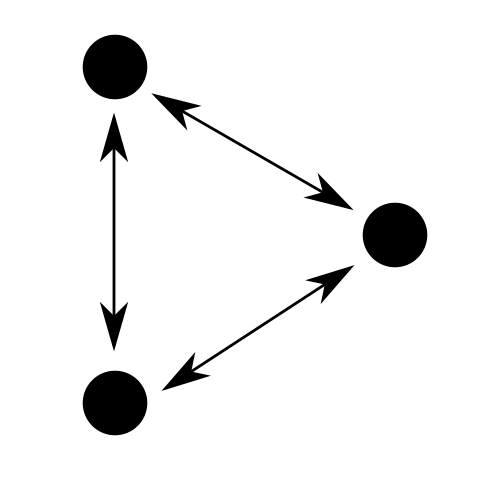
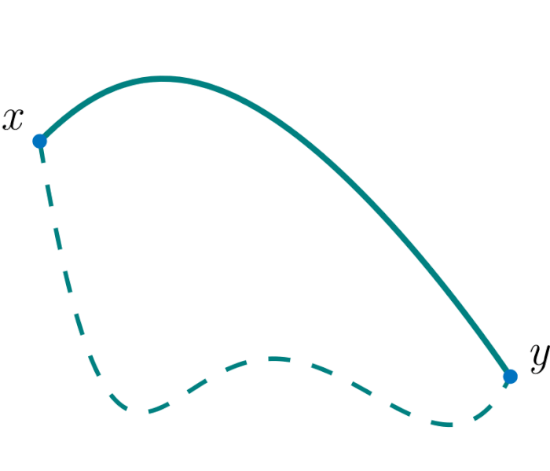

# Trash

 and following some «type theory» for coherence (giving the ability to compare things, using homotopy type theory in our case, as in Manin & Marcolli's model)

{The 'Aside on mathematics' below should clarify the relationships between conversations and documentation on the one hand, and neural networks on the other. {Very practical/organizational stuff -> abstract math -> practical map & language}}

by virtue of consistent encoding into foundational mathematical structures

, they amount to a form of open science. Or, from the reverse but equivalent point of view, we could call it an open science in which the quest for the proper foundations of mathematics extends to a systematic encoding of every "thing". To make sense of this, I must clarify what mathematics I'm talking about—coming up next and accessible to non-mathematicians, before I return to the properties of our AGI architecture.

{ in 1972 d Knuth wanted to make it the primary driver of the craft of writing computer code. It didn't catch on. The industry was in too much of a rush, as industries always are, to go into that time consuming direction. It still is. It's really too bad because if documentation respects those two criteria: (1) it's elaborate enough, and (2) "holistic" in the sense that every piece of documentation targets interoperability with documentation coming from other sources, then this notion derives into...}

It also derives into general notions of information sharing and "life in common", it has a philosophical underpinning («perspectivalism») and in many ways it can *rectify* the current political paradigm.

All those projects must share a common theoretical backbone for their documentation, found in abstract mathematics, specifically in appliced category theory. Together they would form a network of congruent documentations, a kind of open science, upon which we can build AGI systems. {Open science in which the quest for the proper foundations of mathematics (hott) extends to a systematic encoding of every "thing" (topos). The common thread, that which allows the seamless passing of information between the different subsystems of figure 1, is the mathematical structures.}

    Documentation is a natural solution to the problems posed by evolution to humans. What's the problem (information sharing: how?), what's the solution (information sharing: convs & empathy) (see figure 3) <= play the grothendieck card à fond. He is the architect of the common structure between experience, documentation,  (it is more rewarding to think in terms of arrows rather than structures), his methodology is the "invariant" between his theoratical geekism and practical radicalism,
    
        {not the mere addition of fancy Greek words into English---where the old and respectable civilization meets the new and currently dominating civilization)}

    What is naturailty in math? A specific class or type or kind of solutions. The name refers to the fact that those solutions have a qualitative aspect, requiring simple machinery and exposing beautiful structures. Defined negatively: it does not use "mind-bogging technicalities" (for theoretical geeks), "cheats" or "hacks" (for practical geeks), "cumbersome laws" (for practical radicals) or "unethical means" (for theoretical radicals).
    What is this "solution"? I've insisted on the term "architecture", by which I mean "software architecture". As a concept it has a larger scope, but as a solution it is just a program (a congruence class of).
    Sadly really hard to "expose to the outside world", the next point might seem nebulous to most. But this prgram is a "natural" solution in a mathematical sense.
    It can be stated in a series of statements. First, let me give compact abstractions for the concepts of typing and unityping:
    
    - typing: has to do with the more fundamental notion of information, for which types serve as containers endowed with extra properties, e.g. they can be "sorted", "multiplicated", "composed", "be assigned a path to another container in a topology", etc.
    - unityping: is the same as above with the extra restriction that all the containers are of a unique type.
    
    Now, the series of statements, a conjecture of sort (the symbol | is used to mean OR):

    - typing is important | useful
    - unityping has advantages over typing in certain situations
    - the abstract | language & communication is able to mobilize typing
        - for computability, categorification, homotopies...
        - via documentation
    - reality | "life in common" poses problems when implementing typing on cognitive resources, while unityping efficiently and sustainably (recursively~continuous algorithm of networks) solves those problems.

    This is our AGI architecture, which is implicit in M&M model in the way they use concurrency and a theory of resources.

    Another presentation, in a sentence,could be: "The «terminal object» is the best organizational principle in the most generic context." Where "the «terminal object»" is a stand-in for what Grothendieck called "his vision", his whole point of view on mathematics, and where "the most generic context" is a generalized version of evolution (encompassing logic, math, physics, biology, psychology; whose ground concept is not natural selection but the mathematical notion of covering | simplicial sets | fundamental groupoids).

    An alternative presentation uses the interpretation of groupoids and homotopies in the theory of attachment, as conversations and empathy respectively. It is sketched in figure 5.

     Philosophically, if reality was just a car, we would want the abstract space to be a plan, or documentation, of this car. And the first rule of being a plan is *not* to be thing itself.

Of course there are plenty of adequate criticism of the 4 mechaninsms in theoretical radicalism (cybernetics, holism, post-modernism...) but all of them tend to preserve the status of the analyst and specialization in general (both are necessary for the legitimacy of the critic itself). I do not claim to have a privileged status in the research community. The work I've done was quite accessible and only required wiring together a number of concepts coming from . Difficulty lies in the separatedness of those concepts in academia, which requires going up and down in its convoluted tower of Babel. It is made easy once you've understood the foundational design principles behind all the concepts involved, which is best described by the metaphor of "horizontality".
On the contrary, and in line with this research, I claim a special status for the ideas presented in this article: they compose a "natural" solution to the current problems facing humanity, at an "evolutionary" scale. Evolutionary because what . And natural in a mathematical sense.

-> Critics abond in theoretical radicalism (cybernetics, holism, post-modernism..., but they always keep the status of the critics (necessary for the legitimacy of the critic itself). Even though "unlegitimate from the point of university", the most acute critics come from "primitives"/cultures who realy know an laternative and "disanfranchised"/cultures who know misery. I do not claim any status and actually positively demand to be unstatufied (which I am by default, I have not been selected, acheived a hierarchical position, been elected as a representent, I have no role). But the concept has a status: it is an engineering solution to a general problem which is natural in a mathematical sense. -> Paragraph on sources

{
{...and it gives credit to what would be pure conjecture---but nevertheless surfaces from Marcolli's research}. At the same time, it's best to explain the gist of the political "algorithm" in technical terms (it is clearer, makes its purpose ~evident and avoids ~drama).

Before: It's always assumed that only expertise (typifaction of humans, specialization) can enhance the general amount of knowledge of a social system. But it depends how you count. What does the *network* know? Is fluidity/sharing a factor? Brains tend to be "smart" when they're interconnected. {Is it just specific_item.exist_once accumulator or specific_item.times_number_of_holders on a network.}

I will now give a compact version of the alternative our AGI architecture suggest, in (accessible) geeky terms. Aside on "in nature" in math lingo -> the structures that appear when solving interesting problems, {true?: again and again + useful => "natural"}. A foundational notion on the technical side is that of a *type* (or a type system, type theory, etc.) used by both mathematician and computer scientists to work as "boxes for stuff". Basically, {box = type (allowed values) = numbers/lists/..., stuff = "term" = 3/["e", "b", "o"]/... ; the system *defines* boxes and operations/procedures on boxes, then *applies* to stuff; bugs = wrong box/type => impossible procedure for a term/thing}. There are two kinds of type systems: (a) untyped, where every bit of stuff goes into the same box (might sound unsophisticated but is extremely important "in nature"; should be and sometimes is called unityped) In a nutshell, our AGI architecture requires that "informants" (humans) are all considered to be of the same type, and thus the operations the system/computer program applies/"demands of" them are always the same: the system only knows one way to interact with the informants (as "terms", they can be as diverse as they want, only the box is unique, and they should be as diverse as possible for the system to do interesting things). This ensures "no assumptions" and freedom of thought (really freedom of point of view on the world). ~= peer review. No ethical motivations whatsoever, but it "turns out" that the most efficient system agrees with our most general notions of decency and fairness (in a nutshell, what humans call a "honest conversation"). Only information is typed (=> documentation), but because the system "wastes no energy" in typing humans, it can focus on typing information. This lowers the costs of learning new things for humans (vs. "tribal knowledge"), of comparing things (homotopies) and putting our knowledge in proper/scientific networks. Vs. google's knowledge graph which is a grossly distorted view on our world, that of marketing (what the internet, a possible heaven of communication, has become, the dot com stands for commercial, not communication).  
Allow & require -> adjunction: the secondary typed part requires unityping of primary part ; the unityping of primary part allows the typing of secondary part.
On a philosophical level: typification traps

Notes: At this point I would like to indicate that I first thought about this architecture as a engineer of human communication systems. I then proceeded to find it a mathematical model, which I found in Grothendieck & Lawvere mathematics, and only recently did I find out about the same model in Manin & Marcolli's cognitive systems (this overlap in a way validates my research up to this point). In order to widen my understanding of my architecture and its context, I used the theoretical bidges of category theory as well as the practical principles of the implementation to make arrays in other domains of inquiry (philosophy, physics, biology as well as humanities)*. The next step was to find the most compact abstractions, algorithms, diagrams, etc. and eventually present the most interesting and convincing aspects in a relatively short article with manageable complexity.

*: list of sources in respective order: ...

} <- remplaces what's below

goes into last part (return to generalized mother -> {
To sketch an alternative model to civilization and its 4 mechanisms, I will first introduce an abstraction of the theory of attachment. This theory describes the child - parent - community relationships for all mamals, in biological and psychological terms. In many intersting ways, civilization can be seen as a "virus" (it corrupts the function of the system intended by the genetic code) or "genetically inherited defect" (the "viral" function gets encoded in the genome) infecting the implementation of a theory of attachment, us/ours. The abstraction, or essence, of attachment is a simple algorithm of networks, and all I need from it to make my point:  

1. Any new element expect to be taken care of by the network.  
2. The networks expects older elements to take care of new elements.
{This requires the autonomy of the elements, allowing a degree of autonomy to the network. -> that which is not allowed by the 4 mechanisms.}

While this was true in general for most of human history, it has been substantially altered over the last 10,000 years, such that we have now:

1. The system expects the tasks it produces to be fulfilled.  
2. The system redistributes output of completed tasks to individuals.  

It started in the Neolithic, giving rise to unstability, and finding a sort of equilibrium, a new algorithm, with civilization.

Theory of attachment, with attachment the victim of civilization, from interpretation of foundational math concepts. Attachment.generalization = the network takes care of new element, new element evolves into something capable of taking care of new elements. Our communities are broken, replaced by institutions carrying the "4 mechanisms virus". Solution is in Figure 3: groupoid = conversation, homotopy = empathy. Discuss mutilations {---what should have been the fruit of communal fostering of individual thinking, which is absent and invisible).}.
}

Figure 3:  

---
 
> This is the legend
---

Also, the main sources of inspiration for the AGI system I suggest are all anchored on both sides, "geeky" and "radical":  
(All information retrievable from the respective Wikipedia pages)

- Alexander Grothendieck is the principal architect of the mathematical structures used by Manin & Marcolli for their model of cognitive systems. He also quit his confortable position in the French reserach system on the grounds that it was funded by the military, to start an activism-oriented journal on ecology called "Survivre et vivre".

- Noam Chomsky is a linguist and co-author of Marcolli, together they explore the links between mathematical strucutres and "universal grammar", the common core of all human languages. He also identifies as an anarcho-syndicalist or a libertarian socialist.

- Gilles Deleuze is a philosopher who produced a «perspectivalist» framework, in which truth is not absolute as in most philosophical traditions but dependent on a specific point of view; without being totally dependent on it, as in relativism. This perspectivalism can serve as a motivation, or *raison d'être*, for our AGI architecture. Like Grothendieck and Chomsky, he was very close to the 1960s' counter-culture and critical of capitalism and all control mechanisms. A key idea for us would be: "Modern society still suppresses difference [≅ being] and alienates people from what they can do" ({~grothendieck also mentions mutilations in his science quiting talk; reference to the "forbidden arrow" between informants and status~}).

-> Paragraph on mutilations, social determinism (black box), attachment theory, addiction...

({~grothendieck also mentions mutilations in his science quiting talk; reference to the "forbidden arrow" between informants and status~}).

-> Paragraph on mutilations, social determinism (black box), attachment theory, addiction...

## (Mathematical) naturality of the suggested documentation framework

In its "geeky" incarnation, the suggested AGI system is a form of open science (science without selection of individuals/cognitive resources---which is not the same as science without truth criteria, similar to how perspectivalism is not relativism). In its "radical" incarnation it is a resistance network enabling the creation of autonomous communities, occupying new abstract spaces and based on different principles than the 4 mechanisms of civilization (not a reform of the existing system, not a revolution wanting to take it down, but a process which *creates its own space*, as I will explain more in details below). These two incarnations are co-dependent: communities need complexity/science for sustainable growth, while complexity itself needs communities to create adequate spaces in which it can emerge.

I won't compare civilization and our documentation-powered AGI system point by point, but focus on those three aspects: (1) people are ready for it, (2) it's accessible and (3) it's "natural" in a mathematical sense.

1. People are ready for the paradigm shift and demonstrated their willingness to look for collective structures outside the 4 mechanisms during the wave of popular protests of the period 2018-2019 (see The age of mass protests by SJ Brannen, CS Haig, K Schmidt). In about 40 different countries, movements emerged with unmistakable common traits, which all have to do with the *negation* of the 4 mechanisms. They didn't have:

    - representation, the movements were decidedly "bottom up" or "grassroots", and didn't have public figures as leaders
    - hierarchy, the movements had horizontal/diffuse internal structure
    - selection, the aim of the movement, or rather its *raison d'être*, was not defined in advance

What conditioned adhesion was not a specific set of held beliefs but the organizational philosophy of the movement. While their influence on the collective mindset was certain (but largely wiped off by the Covid crisis which directly followed), their actions didn't amount to anything concrete and durable: they never *specialized* to anything which could become an acceptable member of the body of institutions, such as a union or political party. They would have had to renounce their organizational and philosophical principles to do so. As such they exhibited a new form of practical "societal maturity", but without enough theoretical "political maturity" to turn their spontaneous movements into the structures adapted to their philosophy. (The only existing political structure compatible with it are citizen assemblies, which I will use as the "base module" for the documentation procedure explained below.)
-> it is a movement away from shut-down, into stress and joy, a reclaiming of sorts of one's thinking and "life in common"-ness (one's politics, but the interpretation/semantics of this word is as degenerate as the political system).

> Notes: At this point I would like to indicate that I first thought about this architecture as a engineer of human communication systems. I then proceeded to find it a mathematical model, which I found in Grothendieck & Lawvere mathematics, and only recently did I find out about the same model in Manin & Marcolli's cognitive systems (this overlap in a way validates my research up to this point). In order to widen my understanding of my architecture and its context, I used the theoretical bidges of category theory as well as the practical principles of the implementation to make arrays in other domains of inquiry (philosophy, physics, biology as well as humanities)*. The next step was to find the most compact abstractions, algorithms, diagrams, etc. and eventually present the most interesting and convincing aspects in a relatively short article with manageable complexity.

*: list of sources in respective order: ... <

1. -> A crucial  «design principle» of our AGI architecture which is mandated by the mathematical structure is clear separation between the abstract (≅ "where we do language") and reality (≅ "where we do life"). Every network of open projects should be "insulated" and have as little link with reality as possible on the one hand, and manage its own language on the other. It is this principle which induces the creation of a new space. It has lots of advantages for the abstract module (what emerges in the new space), but also for reality itself, which is protected from a possibly detrimental influence from the abstract realm, for instance: AI systems are safe (no mechanical leverrage of AI in reality, no AI takeover possible, no global schizophrenia/loss of sense of reality...); it avoids "broacasting aparatus" interferences such as advertising/marketing/lobbying/... and other opinion & moral compass influences, , ;

The implementation of the architecture is accessible because it will *indirectly* replace the 4 mechanisms with new structures coming *directly* from the foundations of mathematics.

    - Because the replacement is indirect, there is no need to modify existing structures. The new paradigm will emerge in a new abstract space, meaning it will be an entity made of thought, language, computer code, mathematical structures and their documentation (in a much more elaborte and theoretically deep form than current documentation). This space will be new: it will start empty and only allow information to come in according to a unique protocol for all "informants" (humans in conversations) and following some «type theory» for coherence (giving the ability to compare things, using homotopy type theory in our case, as in Manin & Marcolli's model). See fig. 1: The "cell model" of new abstract spaces. Both the initial emptiness and the uniqueness of the protocol are filters/safeguards against the introduction of assumptions/false postivies into the new space. (Interestingly, they are also in direct conflict, meaning that they are mutually exclusive, with the 4 mechanisms of civilization, which require them as «dependencies».) This homotopy-based abstract space is expected to evolve into a complex and multidimensional network of concepts which could be viewed as a map of the informants' context, our world, or as a "universal technical language" (a language purposefully designed for science and engineering, with managable complexity (thanks to homotopies) and extremely useful (for our "life in common" problems).
    {not the mere addition of fancy Greek words into English---where the old and respectable civilization meets the new and currently dominating civilization)}

    - Because the base concepts are mathematical stuctures and they only require some computer code and internet access to run, the costs of implementation are very cheap. The system is moreover totally autonomous, without control mechanisms, without managers. People are ready for such organizations, it only waits for the recognition and legitimation of its concept to start and grow. (Its parts are all legetimate concepts in the eyes of the research community already, but the combination of them is not yet discussed in the scientific litterature.)

{
Civilization is mostly grounded on its economy, which has now reached global covering. This economy is based on the concept, or "module", of debt (see David Grabber), from which follow the modules of legal_system, finance, money and two markets: jobs, goods_&_services. It is main implementation of the series of assignments: specialization, selection, hierarchy, representation, we saw in figure 3. {In the collective mind, especially in the lower echelons of the population, it is a "forteresse imprenable dont la domination est inescapable". It trully is, but again, the possible paradigm shift is *not* going to try and "take" the fortress or destroy the links of domination, but simply build something else in a new space, made of free work and open projects. See figure 4 for a sketch of a possible alternative I believe is made concretely accessible by the political side of our AGI architecture.
}

1. Documentation is a natural solution to the problems posed by evolution to humans. What's the problem (information sharing: how?), what's the solution (information sharing: convs & empathy) (see figure 3) <= play the grothendieck card à fond. He is the architect of the common structure between experience, documentation,  (it is more rewarding to think in terms of arrows rather than structures), his methodology is the "invariant" between his theoratical geekism and practical radicalism,

From univalence to universality (not the one of the enlightenment, obviously), and away from set theory (4 mechanisms).

This link with the foundations of mathematics suggests a very interesting epistemological arch to the story: the bridge between Grothendieck the theoretical geek and Grothendieck the practical radical. A link he himself didn't think existed, even after having looked for it, as he confessed in his talk entitled "Should we continue scientific research?".

Q&A about our AGI architecture (leave "relation to attachment" and "place in evol" for conclusion)

The common trait: Grothendieck's methodology. multiplicity of PoVs ; naturality. Multi-PoVs -> doc & M&M model ; naturality -> how doc & M&M model solve naturally a sharing of information problem, all the way to a sustainable dynamical system.
And turn to naturallity.

Besides the practical aspects of AGI as a global solution, to conclude this intorduction I would like to talk about "naturallity" in mathematics. (To contrast with hacks and cheats in coding).

----

not about ethics but efficiency. (but the most efficient system is also ethical, and logically so, unethical systems have "tension" and "fricition")
Finish with historical remarks on engineering (sewer system vs. human post) -> civi's bad engineering ("max" vs "optimal") ≅ civi's bad doc.

## What is documentation?

Figure 3 illustrates the importance of this concept in computer programming. Legend/explanation.

So, by documentation I mean in particular the complementary information which is supposed to accompany any piece of computer code. More generally, it is the information related to any human activity put in a readable and reusable formated document. For example a recipe, an evacuation floor plan or a tourist guide book. It is especially relevant in the context of software developement because (memory loss vs complex intricate network of responsibilities and dependencies). Knuth wanted to make it the pillar of the profession and computer language alike (clean code + pragmatic prog.).

More doc, less spe/sel/hie/rep, more freedom.
What this article is about. AI -> AGI, documentation -> foundation for life in common.
(It will take geeky stuff indeed, with help from radicals.)

=> in which I explain how documentation was once recognized as fundamental (for obvious reasons if you look at the wikipedia definition), undone in the (gold) rush of the capitalisitc development of programming practicies, ignored by the universities because of elitism, hindered by copyright/closedness of R&D departments. Its development is necessary for implementing the "geeky side", in order to get the benefits of the "radical side". In a well-designed format it is both a formidable tool in itself and indeed its output could be a perfect fit for M&M model.

## AGI as a multidimensional cognitive system

=> In which I explain how documentation can replace LLMs and other data-scraping based input formats for connectivist architectures. Why should this architecture produce interresting results on the "purely cognitive" level. How should this architecture produce interesting results at on the civilizational level.

Data science is a branch of marketing, not science

## Return to (generalized) mother

Sumer -> ¬freedom (Summer -> harsh conditions ; Sumer -> legislation ; Sumer -> "education" ; Sumer -> ...)
It is a well observed fact of attachment theory: the exploration phase with "return to home base/security" (-> world, <- mother)
We should consider ourselves in this phase, in a "cosmological theory of attachment", as a new element. We must seek help from existing network, which we do through logic & math, science & engineering, art & philosophy, love & communication. The first 4 := <- generalized mother (mother nature); last 4 := -> world (unknown). <-> ⇒ freedom.
Our AGI architecture is a structure to build/implement "<-", it must have a dual (in the mathematical sense) which gives "->" (I suspect this structure is the unabridged freedom allowed by the "bridge to mother nature").

Regardless of the cultures you have access to,

Probably not what is generally expected though, and in many ways opposite to the promised "high-tech heaven" of ultraconnected quantum AIs powered by nuclear fusion inside a blockchain economy, or something along those lines.

, which is smart enough to notice it (see Intergovernmental Panel on Climate Change) but dumb enough to keep going (see every United Nations Climate Change Conference)

On the The AGI system can provide "positive" counterparts to those negatitions, and take in this kind of "cognitive energy" to produce something:
it doesn't require to accept certain views in advance and it can define its own purpose as it evolves through its participants;

As for the "paths to complexity" of alternative paradigms, they are once again largely ignored, as with African egalitarianism.

    There is nothing myserious about those abstract spaces, they are used daily every time someone conceives a story, a painting, a theorem or even uters a sentence. The ones we use are nevertheless part of a large web, 
    
    
     ~~Abstract spaces, like novels or , emerged in a new abstract space, and their production didn't require any modification to the existing world.~~ What the AGI system can do is create a coherent abstract space which can serve as a very elaborate map of the existing world. As such it can help our own evolution in this world.

The research community, like kings, is afraid of "the crowd"---more than kings, this blocks the exploration of new social structures.

Bak, Hoffmayer (biosemiotics), porges,

In if we think in terms of the theory of attachment (paragraph 1), we can ask: what is the future of a new element arriving on the network, the markets in this case? This element is a human destined to be a job seeker in a job market first, and second, conditioned by their job status, they are consummers in the goods & services market (the role of "the left" has been to mitigate and pacify this act of violence, but it has not found an efficient alternative). This is preceded by a period during which the "natural attachment mechanisms" of family ties are supposed to take care of the newly arriving human while the selection process starts at the end of infancy and ends at the end of adolecence. It has been called, and
It would take a much longer article to discuss the global economy and its possibly more efficient alternatives, but I would like nonetheless to give pointers to some conjectures I made, about "modules" and their interactions---also too intricate to be properly included here. I then leave a large part of the construction to the imagination of the reader. The current economy is based on debt, which

(you will notice a war is always announced as: "name_of_the_human_agressor" strikes "name_of_the_nation")

This food is cheap though, and .

{
This will be an unconventional article about AI. It doesn't share the current enthusiasm for large datasets/large models. {known problems as explanation of what those models are}. I don't claim to be a specialist of AI and simply trust the judgment of Matilde Marcoli in this regard, like one would trust the judgment of a teacher who has provided very interresting, rewarding and beautiful concepts. Her critic is specifically geared towards the *theory* of Large Language Models, which she claims can't apprehend language on a computational level because it was *already* unable to apprehend language on a purely linguistic level ({see Zelig Harris}). The problem thus concerns not neural network themselves but the "food" we give those networks. The current successes of AI are based on an efficient approach to <<connectivism>> (neural networks), which is still a prominent feature of our AGI architecture---its main processing unit, but ... new context (my proposition, an "offering" for M&M systems).
Unconventional AI article, doesn't share current enthusiasm around large models/datasets. Marcoli's critics. Connectivism stays, but we need to offer it a new context.

Concurrency -> actor model/unityping, protocols, consensus...

{Plenty of enthusiasm for this replacement. Beyond AGI... open source eco. Open source projects are all anchored on one/few experts, doc can change that -> DDD. See figure 1 for its place in the community.}
}

-> Current documentation problems (private/not open; no theory, no math, no "naturality", just "naive" illustrations with conventions/graphical note taking; do not expand understanding, just record keeping for those already "in the know"; purely technical; very little context; independent/non compatible with science)
-> Current datascience problems (see Marcolli for LLM)
-> Suggested open documentation (doc for open projects) framework: methodology, theoretical foundation, evolution.

(democracy/oligarchy is represented in the diagram, with several options on the right hand side, a dictatorship would be the same diagram with only one option.)  

- Selection was for a long time just heredity and reserved to males, with females being directly specialized in a domestic role. Modernity introduced schools, where the ability to regurgitate knowledge, form correct sentences or use arithmetic was tested in order to fill in some key roles in the new economy. This is more or less where we stand now, excepting for the evolution of the economy and therefore the roles to be filled. It serves as... control system = {hierarchy + representation}

### Abstract for "geeks"

After some reflections on "team-oriented" game theory and collective intelligence, I became convinced that the good old notion of documentation is the key to creating scalable and interconnected open source projects, together with a new form of Artificial General Intelligence (based on the biomimetic mathematical model proposed by Yuri Manin and Matilde Marcolli in "Homotopy-theoretic and categorical models of neural information networks").

Before becoming a program, every project is a concept. The proper start to collective endeavor must be the construction of a consensus around the concept and its representation by mathematics-inspired documentation.

This should include both the program and, crucially, its context. Using abstract math and elaborate notions of equivalence and composability (category theory), if enough open source projects formulate their context with modularity in mind, then we get a coherent "map of their shared world".

In this way, open source development can lead to open science. An autonomous, network-oriented and truly peer reviewed science, free from reductionist methodologies as well as age-old assumptions stemming from deference to hierarchies which prevent the logical invalidation of patriarchy, racism and all forms of discrimination, armed conflicts, class struggle and the need for poverty, etc.

In a modus operandi inspired by dynamical systems theory, the output of this collective effort can be plugged back into an AGI system. This is made possible by the fact that the mathematical structures which are advocated by Manin and Marcolli for their model of "cognitive machines" are the same as the mathematical structures which could allow the compatibility between documentations of programs (homotopy type theory, ∞-groupoids).

Those mathematical structures are moreover studied for their ability to be the foundations of all mathematics, following the groundwork of Alexende

---

#### Aside on mathematics

##### What is mathematics for non-mathematicians?

Crucially for us, mathematics decidedly is *not* what mainstream economists, sociologists or other "reality-analysts" make out of it: a reduction of incredibly complex situations into "simplistic" structures like equations. (Which only works within the confines of the fields of physics, starts breaking down in biology, and fails spectacularly in humanities, for reasons we shall see below.) This is sadly what the general public think math is, and before starting my research, I thought so too.

While this
{This is the lovechild of reductionist methodolies in epistemology and justifications for political inequalities via a distoredly individualistic vision of Nature in political theory.}

{Want to convince you that math, certain visions of it, is much richer and subtle, crucially, capable of ambiguity, and that it can welcome the full complexity of Nature and the human mind.}

##### What is mathematics, really?

There is a sort of paradox regarding the definition of mathematics. While mathematicians have no difficulties agreeing on whether a specific object/concept is or isn't part of the mathematical world, they still can't find consensus on a general definition for the field (see the brilliant book by R. Hersh 'What is mathematics, *really*?'). Also, the foundations of mathematics—its "theory of atomic constituents", is a constantly evolving topic, far from being settled today.

{In a personal take on the topic, which I present humbly only as a way of understanding, not as a formal statement} I will contend that mathematics—contrary to its reputation, is very much a matter of perspectives. In a sense there is just one mathematics, but it is, in itself, a collection of points of view on itself. The different branches of mathematics (number theory, geometry, algebra, topology, etc.) and their myriad subtleties are all lines starting from a different origin but ending at the same location. Mathematics is not any of those lines, but the "something" about this location which permits their unification. (Equivalently, you can see it in reverse and think of math as the origin and all the lines out of it as leading to a specific section of it.)

To give a sense of how it could work to non-mathematicians, I will quote Alexander Grothendieck, whose work permeates this article, here talking about «motifs», a most crucial concept in the understanding of the mathematical world (suppressing some technical details):

> "I finally realized the obvious: as long as we make the effort to describe [elements] which take into account all the structures associated to a motif, we descibe the motif itself."
>
> (In 'Récoltes et Semailles': "Toujours est-il que j’ai fini par me rendre compte de cette chose, en elle-même évidente pourtant une fois qu’on se met devant : c’est que du moment qu’on prend la peine de décrire des coefficients suffisamment «fins», c’est à dire, tenant compte de toutes les structures connues associées à un motif, on finit par décrire le motif lui-même.")

Math is elusive because of its inherent multiplicity, or its network-oriented structure. But that does not prevent its univocity, and in a sense permits it. (This last sentence can be read in "plain English", or for a more subtle interpretation, using Gilles Deleuze's concepts, where a network is a rhizome.)

##### Stages of abstraction & parrallel with ecosystems

In a beautiful lecture called 'Categorification of Fourier Theory', mathematician Jacob Lurie starts by summing up the history of his field in three stages (his words are in “quotation marks“):

1. “statements about very concrete objects, like two numbers are equal”
1. “statements about abstract structures, like two vector spaces are isomorphic”
1. “statements about classes (families) of abstract structures—called categories, like two categories are equivalent”

The further we go in abstraction, the less assertive the statements become: “Yes/no questions and answers” in (1) give way to “constructions” of witnesses of a proof of sameness in (2), which eventually get bundled up into fully fledged translations between “two languages describing the same underlying structure” in (3).

To bring some light into those abstractions, I suggest a direct comparison with Earth's ecosystem:

1. Concrete things are genes, which can be assertively compared.
1. Abstract structures are organisms, viewed as sets of «phenotypes» (the biological functions of specific sets of genes), which are akin to constructions witnessing the relevance of a certain function in a given context—in other words, surviving organisms *prove* the relevance of their biological functions in their ecological niche. Those phenotypes are hard to compare.
1. Classes of abstract structures correspond to the ecosystem itself, the most abstract and "higher up" structure, as the representation of families of organisms. (It can hardly be compared because there is only one, but following the comparison using the mathematical side as a template yields a very interesting point of view on evolution.)

Lurie's words, “two languages describing the same underlying structure”, echo the quotation of Grothendieck above.

...

##### Overview of structures used for encoding

---
